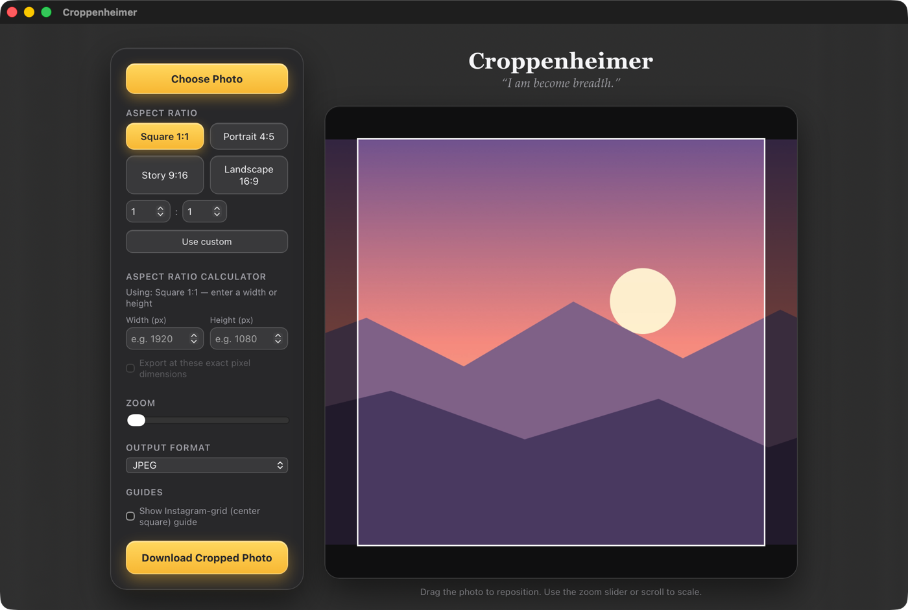
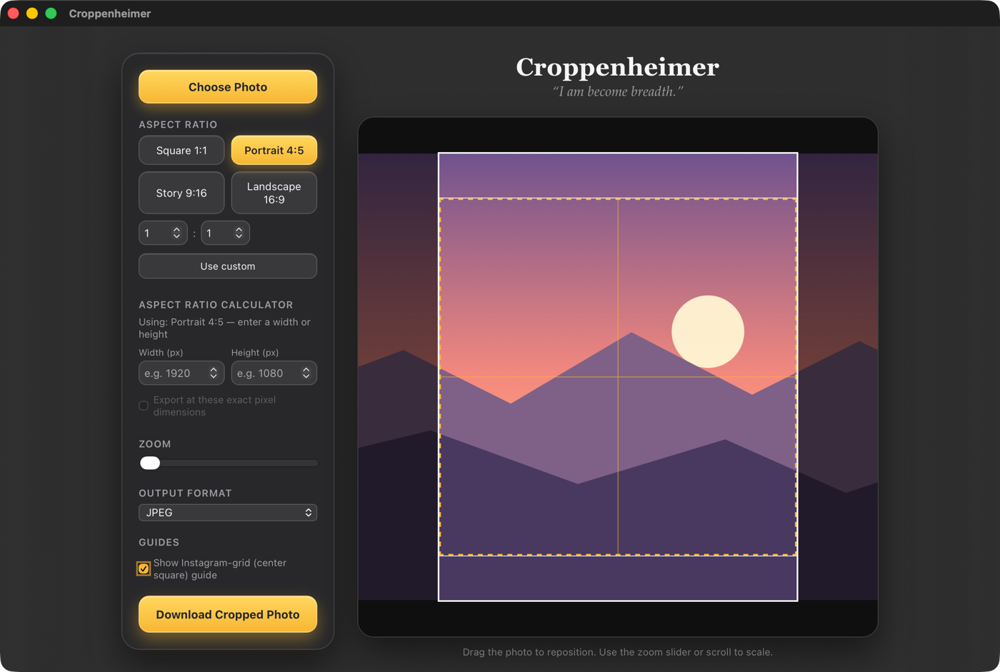
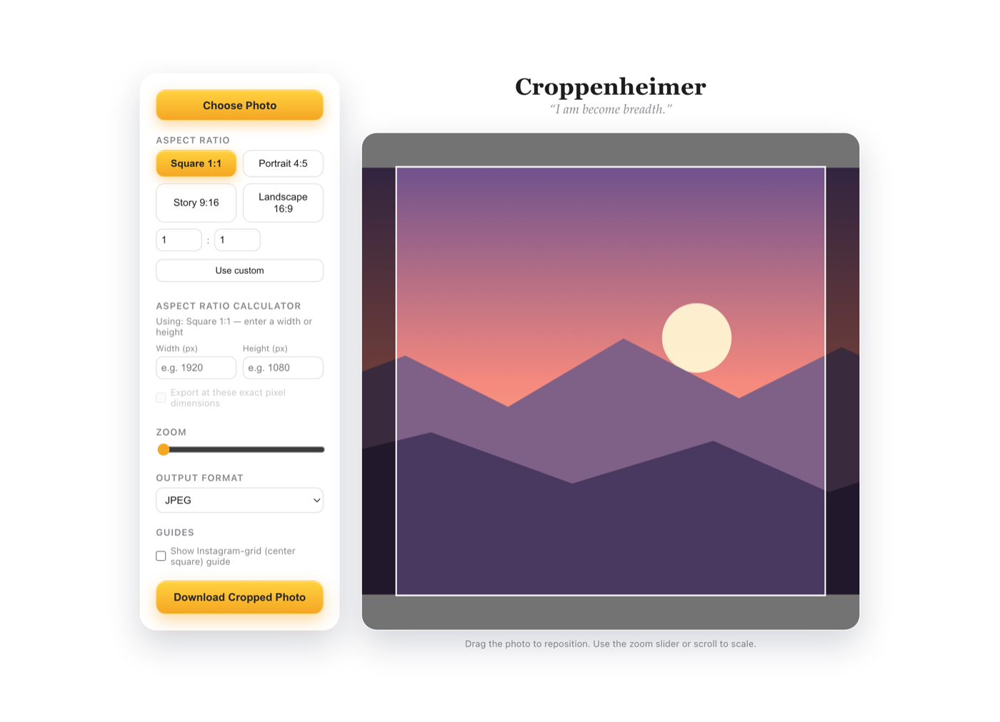
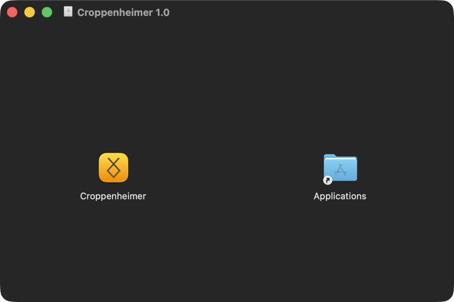
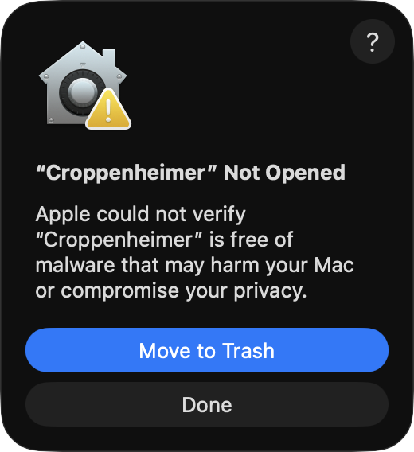
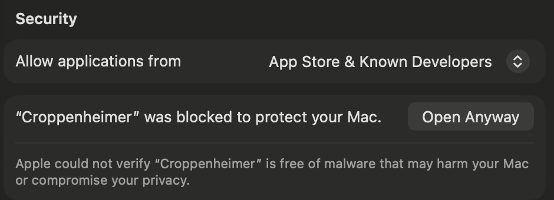

<div align="center">


# Croppenheimer

**“I am become breadth.”**

A fast, private photo cropper for social-media aspect ratios — as a native Mac app with a desktop widget, or as a single HTML file that runs in any browser.

</div>



---

## What it does

Drop in a photo, pick an aspect ratio, drag to frame it, export. That's it — no accounts, no uploads, no waiting.

- **Presets for the ratios you actually use** — Square 1:1, Portrait 4:5, Story 9:16, Landscape 16:9, plus any custom ratio you type in.
- **Aspect-ratio calculator** — enter a width *or* a height and it fills in the other side for the active ratio. Enter both and it tells you the ratio they describe, simplified, and offers it as a custom crop.
- **Export at exact pixel dimensions** — optional, and only offered when your numbers actually match the crop ratio, so you can't accidentally squash a photo.
- **Instagram-grid guide** — overlays the centre square that a grid thumbnail will show, so you can check a 4:5 or 16:9 crop still reads as a square preview.
- **Direct manipulation** — drag to reposition, scroll or pinch to zoom, with the crop always clamped inside the photo so you never get transparent edges.
- **JPEG or PNG output**, cropped from the full-resolution original rather than the on-screen preview.
- **Everything stays on your machine.** The photo is never uploaded anywhere.

<table>
<tr>
<td width="50%"><br><em>A 4:5 portrait crop with the Instagram-grid guide showing the centre square.</em></td>
<td width="50%"><br><em>The same tool in a browser. Light and dark follow your system appearance.</em></td>
</tr>
</table>

---

## Two ways to use it

### 1. In your browser — nothing to install

Open **[Croppenheimer.html](Croppenheimer.html)** — one self-contained file, no dependencies, no build step. Download it and double-click, or serve it from anywhere.

### 2. As a Mac app — with a desktop widget

Download the latest **[Croppenheimer .dmg from Releases](../../releases/latest)** and follow the walkthrough below.

The Mac app adds things a web page can't do:

- A **desktop widget** that opens the app in one click.
- **Drag a photo straight onto the window** from Finder to start cropping.
- **Open With → Croppenheimer**, or drop a photo on the Dock icon.
- **Exports default to the folder the photo came from**, instead of always landing in Downloads.
- A **translucent glass window** that picks up your desktop behind it.

---

## Installing the Mac app

**Requirements:** macOS 15 (Sequoia) or later. Universal — runs natively on both Apple Silicon and Intel Macs.

### Step 1 — Open the .dmg and drag Croppenheimer to Applications



Putting it in `/Applications` matters: the widget only shows up in the widget gallery once the app lives there.

### Step 2 — The first launch will be blocked. This is expected.

The app is **signed ad-hoc, not notarized by Apple** (notarizing requires a paid Apple Developer account). macOS therefore refuses to open it the first time and shows this:



Click **Done** — *not* "Move to Trash".

### Step 3 — Allow it in System Settings

Go to  **System Settings → Privacy & Security**, scroll down to **Security**, and click **Open Anyway** next to Croppenheimer:



Confirm once more if asked. From then on it opens normally, like any other app.

> **Prefer the terminal?** This does the same thing in one line:
> ```bash
> xattr -dr com.apple.quarantine /Applications/Croppenheimer.app
> ```

### Step 4 — Add the desktop widget (optional)

1. Right-click (or Control-click) an empty area of your desktop and choose **Edit Widgets**.
2. Search for **Croppenheimer**.
3. Drag either the small or medium widget onto your desktop.

<table>
<tr>
<td></td>
<td></td>
</tr>
</table>

Clicking the widget opens Croppenheimer, ready for a photo.

> Desktop widgets appear muted and monochrome while another app has focus — that's normal macOS behaviour, not a bug. Click your wallpaper and it returns to full colour.

---

## Building from source

You need Xcode 26 or later (the icon is an [Icon Composer](https://developer.apple.com/documentation/xcode/creating-your-app-icon-using-icon-composer) document, which needs Xcode 26's `actool`).

```bash
./scripts/build.sh
```

That regenerates the icon assets, builds a universal Release binary, and packages `Croppenheimer-1.0.dmg`. To build without the script:

```bash
xcodebuild -project Croppenheimer.xcodeproj -target Croppenheimer \
  -configuration Release ARCHS="arm64 x86_64" ONLY_ACTIVE_ARCH=NO build
```

### How it fits together

| Path | What it is |
| --- | --- |
| `Croppenheimer.html` | The whole cropper — UI, crop maths, export. Runs standalone in a browser *and* is what the Mac app displays. |
| `App/CroppenheimerApp.swift` | SwiftUI entry point: one window, glass material, handles incoming photo URLs. |
| `App/WebView.swift` | The `WKWebView` host, plus `PhotoBridge` (native photo intake and source-folder tracking) and `DropWebView` (intercepts Finder file drops so the file's path is knowable). |
| `Widget/CroppenheimerWidget.swift` | The WidgetKit launcher widget, with the rune drawn as a SwiftUI `Shape`. |
| `AppIcon.icon/` | Icon Composer source. `Assets/glyph.svg` is the rune; `icon.json` holds the gold gradient and glass treatment. |
| `App/AppIcon.icns`, `App/Assets.car` | Compiled icon output, committed because the Xcode project bundles them directly. Regenerate with `scripts/build.sh`. |

The single-HTML-file design is deliberate: the browser version and the Mac app are the same code, so a fix to the cropper lands in both.

---

## Notes

- **Not notarized.** See steps 2–3 above. Notarization needs a paid Apple Developer account; without one, any distributed Mac app hits this prompt.
- **Your photos never leave your Mac.** There is no network code in the app at all — the page is loaded from inside the app bundle.
- **HEIC and RAW** files dropped on the Mac app are converted to PNG in memory before being handed to the cropper, so iPhone photos work without a manual conversion step.
